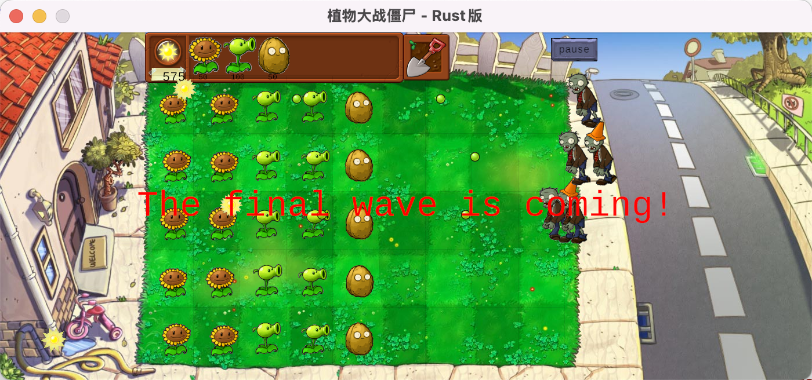

# PVZbyRust

用Rust语言实现的植物大战僵尸游戏

# WARNING：请务必在试玩前把电脑屏幕缩放率调成100%，否则会出现重大bug

[English](README_EN.md) | 简体中文

## 项目简介

这是一个使用Rust语言和ggez游戏引擎开发的植物大战僵尸风格游戏。本项目旨在展示如何使用Rust构建具有良好架构和模式的游戏应用，采用了工厂模式等设计模式使代码更易于扩展和维护。



## 功能特性

- **植物系统**: 包含豌豆射手、向日葵、坚果墙等可种植角色，每种植物具有独特的攻击方式和防御能力
- **僵尸系统**: 包括普通僵尸和路障僵尸，未来可轻松添加更多种类
- **资源管理**: 阳光收集和使用系统，购买和放置植物
- **关卡系统**: 波次进攻，随着时间增加难度
- **用户交互**: 植物选择、铲子功能、暂停功能
- **碰撞检测**: 完善的实体间交互系统

## 技术特点

- **模块化设计**: 代码按照功能清晰地组织为核心、实体、机制、植物、UI和僵尸等模块
- **设计模式**: 使用工厂模式实现植物和僵尸的创建，便于扩展新类型
- **良好的注释**: 详细的文档注释，便于理解代码结构和功能
- **固定帧率**: 游戏以固定的帧率运行，确保游戏体验一致性
- **事件处理**: 完整的用户输入处理系统

## 系统需求

- Rust 2021版本或更高
- 支持图形显示的操作系统（Windows/macOS/Linux）
- 建议分辨率：1400 x 600或更高

## 安装和运行

1. 克隆仓库：
```bash
git clone https://github.com/iamwsll/PVZbyRust.git
cd PVZbyRust
```

2. 编译和运行游戏：
# WARNING：请务必在试玩前把电脑屏幕缩放率调成100%，否则会出现重大bug
```bash
cargo run --release
```

## 游戏操作指南

- **收集阳光**: 点击屏幕上落下的阳光以收集资源
- **种植植物**: 
  1. 点击商店中的植物卡片
  2. 点击草坪网格中的位置放置植物
- **铲除植物**: 
  1. 点击铲子图标
  2. 点击要移除的植物
- **暂停游戏**: 点击屏幕右上角的暂停按钮

## 项目结构

```
src/
├── core/           # 核心游戏引擎
│   ├── game.rs     # 游戏主循环和状态
│   ├── renderer.rs # 渲染系统
│   ├── resources.rs # 资源加载和管理
│   └── states.rs   # 游戏状态定义
├── entities/       # 游戏实体
│   ├── pea.rs      # 豌豆弹药
│   └── sun.rs      # 阳光资源
├── mechanics/      # 游戏机制
│   ├── collision.rs # 碰撞检测
│   ├── entity_manager.rs # 实体管理
│   └── level_controller.rs # 关卡控制
├── plants/         # 植物相关功能
│   ├── peashooter.rs # 豌豆射手
│   ├── plant_factory.rs # 植物工厂
│   ├── plant_trait.rs # 植物特性接口
│   ├── sunflower.rs # 向日葵
│   └── wallnut.rs  # 坚果墙
├── ui/             # 用户界面
│   ├── grid.rs     # 游戏网格
│   ├── input_handler.rs # 输入处理
│   ├── shop.rs     # 植物商店
│   └── shovel.rs   # 铲子功能
├── zombies/        # 僵尸相关功能
│   ├── conehead_zombie.rs # 路障僵尸
│   ├── normal_zombie.rs # 普通僵尸
│   ├── zombie_factory.rs # 僵尸工厂
│   └── zombie_trait.rs # 僵尸特性接口
├── lib.rs          # 库入口
└── main.rs         # 程序入口
```

## 开发者指南

### 添加新植物

1. 在`plants/`目录中创建新植物的实现文件
2. 实现`PlantTrait`特性
3. 在`plant_factory.rs`中的`PlantType`枚举中添加新植物类型
4. 在`PlantType.cost()`方法中添加新植物的成本
5. 在`PlantFactory.create_plant()`中添加新植物的创建逻辑
6. 在`shop.rs`中添加新植物的商店卡片

### 添加新僵尸

1. 在`zombies/`目录中创建新僵尸的实现文件
2. 实现`ZombieTrait`特性
3. 在`zombie_factory.rs`中的`ZombieType`枚举中添加新僵尸类型
4. 在`ZombieFactory.create_zombie()`中添加新僵尸的创建逻辑

## 许可证

本项目使用MIT许可证 - 详见 [LICENSE](LICENSE) 文件。

## 鸣谢

- ggez游戏引擎
- Rust社区的支持
- 原版植物大战僵尸游戏的灵感

## 联系方式

如有任何问题或建议，请发送邮件至 1481121704@qq.com
