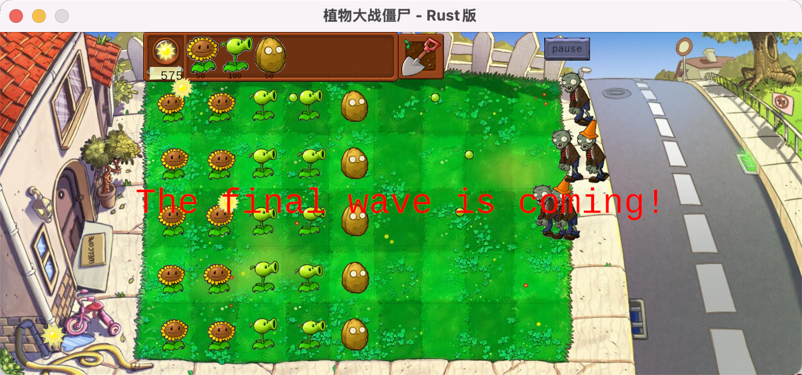

# PVZbyRust

Plants vs. Zombies implemented in Rust

English | [简体中文](README.md)

## Project Overview

This is a Plants vs. Zombies style game developed using Rust language and the ggez game engine. The project aims to demonstrate how to build games with good architecture and patterns in Rust, implementing design patterns such as the factory pattern for better code extensibility and maintainability.



## Features

- **Plant System**: Includes Peashooters, Sunflowers, Wall-nuts, and more plantable characters, each with unique attack methods and defense capabilities
- **Zombie System**: Includes normal zombies and cone-head zombies, with easy extensibility for adding more types
- **Resource Management**: Sun collection and usage system, purchasing and placing plants
- **Level System**: Wave-based attacks with increasing difficulty over time
- **User Interaction**: Plant selection, shovel functionality, pause functionality
- **Collision Detection**: Comprehensive entity interaction system

## Technical Highlights

- **Modular Design**: Code is clearly organized into modules such as core, entities, mechanics, plants, UI, and zombies
- **Design Patterns**: Factory pattern implemented for plant and zombie creation, making it easy to extend with new types
- **Well-Documented**: Detailed documentation comments for better understanding of code structure and functionality
- **Fixed Frame Rate**: Game runs at a fixed frame rate ensuring consistent gameplay experience
- **Event Handling**: Complete user input handling system

## System Requirements

- Rust 2021 edition or higher
- Operating system with graphics support (Windows/macOS/Linux)
- Recommended resolution: 1400 x 600 or higher

## Installation and Running

1. Clone the repository:
```bash
git clone https://github.com/iamwsll/PVZbyRust.git
cd PVZbyRust
```

2. Build and run the game:
```bash
cargo run --release
```

## Game Instructions

- **Collect Sun**: Click on falling suns to collect resources
- **Plant Plants**: 
  1. Click on a plant card in the shop
  2. Click on a position in the lawn grid to place the plant
- **Remove Plants**: 
  1. Click on the shovel icon
  2. Click on the plant you want to remove
- **Pause the Game**: Click the pause button in the upper right corner of the screen

## Project Structure

```
src/
├── core/           # Core game engine
│   ├── game.rs     # Game loop and state
│   ├── renderer.rs # Rendering system
│   ├── resources.rs # Resource loading and management
│   └── states.rs   # Game state definitions
├── entities/       # Game entities
│   ├── pea.rs      # Pea projectiles
│   └── sun.rs      # Sun resources
├── mechanics/      # Game mechanics
│   ├── collision.rs # Collision detection
│   ├── entity_manager.rs # Entity management
│   └── level_controller.rs # Level control
├── plants/         # Plant-related functionality
│   ├── peashooter.rs # Peashooter implementation
│   ├── plant_factory.rs # Plant factory
│   ├── plant_trait.rs # Plant trait interface
│   ├── sunflower.rs # Sunflower implementation
│   └── wallnut.rs  # Wall-nut implementation
├── ui/             # User interface
│   ├── grid.rs     # Game grid
│   ├── input_handler.rs # Input handling
│   ├── shop.rs     # Plant shop
│   └── shovel.rs   # Shovel functionality
├── zombies/        # Zombie-related functionality
│   ├── conehead_zombie.rs # Cone-head zombie
│   ├── normal_zombie.rs # Normal zombie
│   ├── zombie_factory.rs # Zombie factory
│   └── zombie_trait.rs # Zombie trait interface
├── lib.rs          # Library entry point
└── main.rs         # Program entry point
```

## Developer Guide

### Adding New Plants

1. Create a new plant implementation file in the `plants/` directory
2. Implement the `PlantTrait` trait
3. Add the new plant type to the `PlantType` enum in `plant_factory.rs`
4. Add the cost for the new plant in the `PlantType.cost()` method
5. Add the creation logic for the new plant in `PlantFactory.create_plant()`
6. Add the shop card for the new plant in `shop.rs`

### Adding New Zombies

1. Create a new zombie implementation file in the `zombies/` directory
2. Implement the `ZombieTrait` trait
3. Add the new zombie type to the `ZombieType` enum in `zombie_factory.rs`
4. Add the creation logic for the new zombie in `ZombieFactory.create_zombie()`

## License

This project is licensed under the GNU License - see the [LICENSE](LICENSE) file for details.

## Acknowledgments

- ggez game engine
- Rust community for support
- Inspiration from the original Plants vs. Zombies game

## Contact

For any questions or suggestions, please email 1481121704@qq.com
