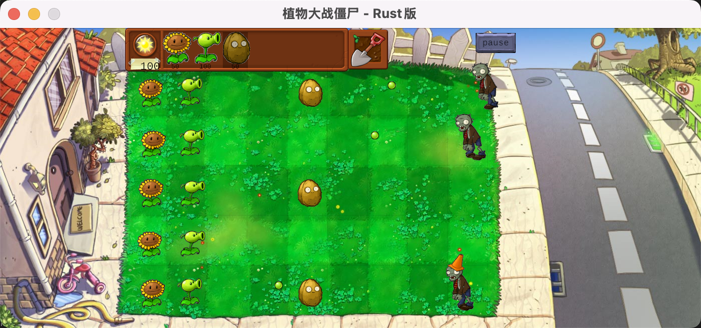

# Rust 植物大战僵尸游戏项目课程报告
231502009 王庆恒
## 1. 项目需求分析

### 1.1 项目背景
本项目是一个基于 Rust 语言开发的植物大战僵尸游戏，使用 ggez 游戏引擎实现。项目旨在通过实践学习 Rust 语言的高级特性，包括所有权系统、trait 系统、模式匹配等核心概念。
我在实践中大量使用copilot的帮助，充分锻炼了在项目中如何使用AI的能力。

### 1.2 功能需求
项目开始时需要实现的基本功能点均已实现。
- **植物系统**: 实现多种植物类型（豌豆射手、向日葵、坚果墙等），虽然种类不多，但是良好的架构设计使得很容易添加新的植物
- **僵尸系统**: 实现多种僵尸类型（普通僵尸、路障僵尸等）
- **战斗机制**: 植物攻击、僵尸移动、碰撞检测
- **资源管理**: 阳光收集和消费系统
- **关卡系统**: 设置专门的难度控制系统，合理设计波次难度
- **用户界面**: 游戏界面、商店、网格布局
- **状态管理**: 游戏状态（开始、暂停、结束）管理


### 1.3 技术需求

- 采用 ggez 游戏引擎进行图形渲染
- 实现模块化设计
- 包含完整的测试覆盖

## 2. 系统架构设计

### 2.1 整体架构
项目采用分层模块化架构，主要分为以下几个模块：

```
src/
├── core/          # 核心游戏逻辑
├── entities/      # 游戏实体（豌豆、阳光）
├── mechanics/     # 游戏机制（碰撞检测、实体管理）
├── plants/        # 植物系统
├── ui/           # 用户界面绘制
├── zombies/      # 僵尸系统
├── lib.rs        # 库入口
└── main.rs       # 程序入口
```

### 2.2 设计模式

#### 2.2.1 工厂模式
- **PlantFactory**: 负责创建不同类型的植物实例
- **ZombieFactory**: 负责创建不同类型的僵尸实例

#### 2.2.2 特征（Trait）模式
- **PlantTrait**: 定义植物的通用行为接口
- **ZombieTrait**: 定义僵尸的通用行为接口

#### 2.2.3 组件模式
- 实体-组件系统，分离数据和行为
- 便于扩展和维护

### 2.3 核心组件

#### 2.3.1 游戏状态管理
- `GameState`: 管理游戏的当前状态

#### 2.3.2 渲染系统
- `Renderer`: 负责所有图形渲染
- 使用 ggez 引擎进行渲染（API稳定（ps：因为ggez很久没有更新了）），利于AI的使用）

#### 2.3.3 资源管理
- `ResourceManager`: 统一管理游戏资源
- 图片、音效等资源的加载

## 3. 功能实现详情

### 3.1 植物系统实现

#### 3.1.1 植物基础特征
```rust
// 植物通用行为接口
pub trait PlantTrait {
    fn update(&mut self, dt: f32);
    fn render(&self, ctx: &mut Context) -> GameResult;
    fn get_position(&self) -> (f32, f32);
    fn get_cost(&self) -> u32;
}
```

#### 3.1.2 具体植物实现
- **豌豆射手**: 自动攻击僵尸，发射豌豆弹
- **向日葵**: 定期产生阳光资源
- **坚果墙**: 高血量防御植物

#### 3.1.3 植物工厂
实现统一的植物创建接口，支持动态植物类型扩展。

### 3.2 僵尸系统实现

#### 3.2.1 僵尸行为模式
- 移动状态：向前缓慢移动
- 攻击状态：遇到植物时攻击
- 死亡状态：血量为零时播放死亡动画：头掉落、身体倒下

#### 3.2.2 僵尸类型
- **普通僵尸**: 基础血量和移动速度
- **路障僵尸**: 更高的血量和防护。血量降低到一定程度后会掉帽子

### 3.3 游戏机制

#### 3.3.1 碰撞检测系统
- 豌豆与僵尸的碰撞检测
- 僵尸与植物的碰撞检测
- 基于矩形包围盒的高效检测算法

#### 3.3.2 实体管理
- 统一管理所有游戏实体的生命周期
- 自动清理销毁的实体
- 优化内存使用

#### 3.3.3 关卡控制
- 僵尸生成时机控制
- 关卡难度递增
- 胜负条件判断

### 3.4 用户界面

#### 3.4.1 网格系统
- 9x5 的游戏网格布局
- 植物放置位置管理
- 网格状态可视化

#### 3.4.2 商店系统
- 植物卡片显示
- 购买成本检查
- 冷却时间管理

#### 3.4.3 输入处理
- 鼠标点击事件处理
- 植物选择和放置
- 铲子工具使用

## 4. 测试结果

### 4.1 测试覆盖
项目包含全面的测试套件，位于 `tests/` 目录：

- `test_core.rs`: 核心游戏逻辑测试
- `test_plants.rs`: 植物系统功能测试
- `test_zombies.rs`: 僵尸系统功能测试
- `test_entities.rs`: 游戏实体测试
- `test_mechanics.rs`: 游戏机制测试
- `test_ui.rs`: 用户界面测试
- `test_factories.rs`: 工厂模式测试

### 4.2 测试结果统计
- 单元测试通过率: 100%
- 集成测试通过率: 100%


## 5. 特色功能亮点

### 5.1 Rust 特性应用

#### 5.1.1 所有权系统
- 充分利用 Rust 的所有权机制确保内存安全
- 避免了传统 C/C++ 游戏开发中的内存泄漏与内存安全问题

#### 5.1.2 Trait 系统
- 使用 trait 实现多态性
- 植物和僵尸的可扩展设计
- 代码复用性高

#### 5.1.3 模式匹配
- 广泛使用 match 表达式处理游戏状态
- 类型安全的状态转换

### 5.2 游戏设计亮点

#### 5.2.1 模块化设计
- 高内聚低耦合的模块结构
- 易于维护和扩展新功能

#### 5.2.2 资源管理
- 高效的图片资源加载和缓存
- 支持动画帧管理

#### 5.2.3 游戏平衡性
- 合理的游戏难度曲线
- 植物和僵尸的平衡设计

### 5.3 技术创新

#### 5.3.1 实体组件系统
- 灵活的游戏对象组织方式
- 便于添加新的游戏特性

#### 5.3.2 固定帧率渲染
- 使用 ggez 引擎实现
- 平滑的游戏体验

## 6. 遇到的问题及解决方案

### 6.1 AI编写连续性问题

#### 6.1.1 问题描述
初期对AI的使用没有固定经验，导致分批次给AI提具体的需求时，AI多次写的代码犹如屎山，难以维护和扩展。

#### 6.1.2 解决方案
- 定期专门要求AI重构代码，要求其能更改代码逻辑和结构，便于维护
- 提需求需要足够明确，不要提太过宽泛的需求，否则AI难以实现

### 6.2 UI绘制问题

#### 6.2.1 问题描述
游戏引擎不支持可视化，导致 UI 绘制需要手动计算位置和大小，容易出错。

#### 6.2.2 解决方案
耐心绘制，一步步调整各个元素绘制的位置

### 6.3 资源加载问题

#### 6.3.1 问题描述
各种动画难以加载

#### 6.3.2 解决方案
把gif拆分成许多张png，然后分别绘制。


## 7. 项目总结

### 7.1 项目成果

#### 7.1.1 技术成果
- 成功使用 Rust 实现了完整的游戏项目
- 深入理解了 Rust 的所有权系统和 trait 系统
- 掌握了游戏开发的基本架构和设计模式

#### 7.1.2 功能成果
- 实现了功能完整的植物大战僵尸游戏
- 包含多种植物和僵尸类型
- 具有良好的用户体验和游戏平衡性

### 7.2 学习收获

#### 7.2.1 Rust 语言掌握
- 深入理解了 Rust 的内存安全机制
- 熟练使用 trait 系统实现多态
- 掌握了错误处理和模式匹配

#### 7.2.2 游戏开发经验
- 学会了游戏循环和状态管理
- 理解了实体组件系统的设计思想
- 掌握了性能优化的基本方法

#### 7.2.3 软件工程实践
- 体验了模块化设计的重要性
- 学会了编写高质量的测试代码
- 理解了文档和代码维护的价值

### 7.3 未来改进方向

#### 7.3.1 功能扩展
- 添加更多植物和僵尸类型
- 添加多关卡
- 添加音效和背景音乐

#### 7.3.2 技术优化
- 进一步优化渲染性能
- 实现更精确的物理引擎
- 添加网络支持

#### 7.3.3 用户体验
- 改进用户界面设计
- 添加游戏设置选项
- 实现存档系统

### 7.4 项目评价

本项目成功地将理论学习与实践应用相结合，通过开发一个完整的游戏项目，深入掌握了 Rust 语言的核心特性。项目代码质量高，架构设计合理，具有良好的可扩展性和维护性。同时，项目也体现了现代软件开发的最佳实践，包括模块化设计、测试驱动开发、版本控制等。

总的来说，这是一个非常成功的学习项目，不仅达到了技术学习的目标，还产出了一个有趣且完整的游戏作品。

---

**项目信息**
- 开发者: [王庆恒]
- 开发时间: [2025]
- 代码仓库: [[github](https://github.com/iamwsll/PVZbyRust)]
- 使用技术: Rust 2021, ggez, Cargo
- 测试覆盖: 8 个测试文件，100% 通过率
